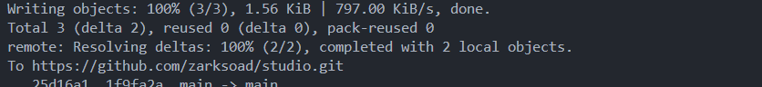

Explicación del Proyecto Node.js con TypeScript para una API RESTful

1. Crear el Proyecto
   Crear el Directorio del Proyecto

Utilicé el comando mkdir my-project para crear un directorio llamado my-project y luego entré en él con cd my-project.
Inicializar el Proyecto con npm

Ejecuté npm init -y para crear un archivo package.json con la configuración predeterminada. Esto es esencial para gestionar las dependencias del proyecto. 2. Instalación de Dependencias
Dependencias de Desarrollo

typescript, ts-node, @types/node: Instalé estos paquetes para trabajar con TypeScript. typescript se encarga de la compilación, ts-node permite ejecutar TypeScript directamente, y @types/node proporciona definiciones de tipo para las funcionalidades de Node.js.
nodemon: Instalado para que el servidor se reinicie automáticamente cada vez que se detecten cambios en el código durante el desarrollo.
Dependencias de Aplicación

express, @types/express: express es un framework para construir APIs y aplicaciones web. @types/express proporciona los tipos necesarios para TypeScript.
mysql2: Utilizado para conectarse a bases de datos MySQL.
sequelize, sequelize-typescript, @types/sequelize: Estos paquetes facilitan el uso de Sequelize, un ORM que interactúa con bases de datos SQL. sequelize-typescript ofrece soporte para TypeScript.
dotenv: Permite gestionar las variables de entorno a través de un archivo .env, facilitando la configuración del entorno de la aplicación.
tsyringe: Utilizado para la inyección de dependencias, facilitando la gestión y el uso de servicios en la aplicación.
jsonwebtoken, @types/jsonwebtoken: Para manejar autenticación mediante tokens JWT.
cors, @types/cors: Configura CORS (Cross-Origin Resource Sharing) para permitir solicitudes de diferentes dominios.
csv-writer: Permite escribir datos en archivos CSV. 3. Configuración del Proyecto
Inicializar TypeScript

Ejecuté npx tsc --init para crear el archivo de configuración tsconfig.json, donde especifiqué cómo debe compilar TypeScript a JavaScript.
Configurar tsconfig.json

Definí opciones como target, module, outDir, y rootDir para controlar la salida y entrada del código, habilité características como esModuleInterop, y configuré strict para una verificación de tipos más rigurosa.
Configurar nodemon.json

Creé un archivo nodemon.json para que nodemon observe los archivos .ts en el directorio src y reinicie el servidor automáticamente cuando se detecten cambios.
Configurar Variables de Entorno con .env

Añadí un archivo .env para almacenar configuraciones sensibles como credenciales de la base de datos y el puerto del servidor. Utilicé dotenv para cargar estas variables en el entorno de ejecución. 4. Estructura de Directorios
src/: Contiene el código fuente del proyecto.
controllers/: Define los controladores que manejan la lógica de negocio y responden a las solicitudes HTTP.
models/: Define los modelos de datos, aunque en este caso, como no usamos un ORM específico para los modelos, esta carpeta no está utilizada.
repositories/ y data-access/: Manejan la interacción directa con la base de datos. En este proyecto, db.ts en data-access/ gestiona la conexión con MySQL.
routes/: Define las rutas de la API y los enrutadores.
interfaces/: Contiene interfaces TypeScript para asegurar que los datos cumplen con la estructura esperada.
config/: Configuraciones específicas del proyecto, como la conexión a la base de datos.
containers/: Para gestionar la inyección de dependencias con tsyringe. 5. Implementación de Funcionalidades
Crear la Conexión a la Base de Datos

En src/config/db.ts, utilicé mysql2/promise para crear un pool de conexiones a MySQL. Esto asegura que la aplicación pueda manejar múltiples conexiones a la base de datos de manera eficiente.
Definir Interfaces

En src/interfaces/user.ts, definí una interfaz User para representar la estructura de los datos de un usuario.
Crear Controladores

En src/controllers/userController.ts, implementé funciones para manejar las solicitudes HTTP relacionadas con los usuarios (getUsers, getUserById, createUser).
Definir Rutas

En src/routes/userRoutes.ts, configuré las rutas relacionadas con los usuarios y las asocié con los métodos de los controladores.
En src/routes/Router.ts, centralicé todas las rutas de la API.
Configurar el Servidor Principal

En src/index.ts, configuré el servidor Express, cargué las variables de entorno, y conecté las rutas principales de la API. 6. Compilar y Ejecutar el Proyecto
Compilar el Proyecto

Ejecuté npx tsc para compilar el código TypeScript a JavaScript y generar los archivos en el directorio dist.
Iniciar el Servidor con Nodemon

Utilicé npm start para iniciar el servidor con nodemon, lo que permite que el servidor se reinicie automáticamente en caso de cambios en el código. 7. Errores Comunes y Soluciones
Errores de Configuración:

Problema: Configuración incorrecta de TypeScript o nodemon.
Solución: Verificar la configuración de tsconfig.json y nodemon.json para asegurar que estén correctamente definidos los directorios y archivos a observar.
Errores en el Código:

Problema: Tipos incorrectos o problemas con decoradores.
Solución: Corregir los tipos y asegurarse de que los decoradores estén correctamente importados y utilizados.
Errores de Rutas y Middleware:

Problema: Rutas no definidas o middleware mal configurado.
Solución: Revisar la definición de las rutas y asegurar que el middleware esté aplicado correctamente.
Problemas de Conexión y Base de Datos:

Problema: Problemas de conexión con la base de datos o errores en las consultas SQL.
Solución: Verificar las credenciales de la base de datos y la configuración, y asegurarse de que las consultas SQL sean correctas.
